# Bongo Buddy

[](LICENSE)
[](CONTRIBUTING.md)

<p align="center">
  
</p>

A tiny bongo cat that lives on your desktop (and your partner's phone) and
starts drumming whenever one of you is typing/coding. It also celebrates
when an "agent task" finishes. Two apps, one shared "room":

- `desktop-app/` — an Electron app for Mac/Windows/Linux. Detects
  system-wide keystrokes (so it reacts while you're coding in your real
  editor, not just inside this window), shows your cat and your partner's
  cat, and runs a tiny local webhook other tools can ping.
- `mobile-app/` — an installable mobile web app (PWA). No app store needed —
  open it in Safari/Chrome and "Add to Home Screen." Mainly shows your
  partner's cat live; also has a scratch box so the phone side can report
  "typing" too.

Both apps talk to the **same Firebase Realtime Database**, and a short
**pairing code** (e.g. `K7XQ2M`) is how two devices find each other — no
accounts, no servers to run yourself.

## 1. Create a free Firebase project (~3 minutes)

1. Go to https://console.firebase.google.com and click **Add project**.
   Name it anything (e.g. "bongo-buddy"), and you can skip Google Analytics.
2. In the left sidebar, go to **Build > Realtime Database** > **Create
   Database**. Pick any region, and start in **test mode** for now (see the
   security rules note below).
3. Go to **Project settings** (gear icon) > scroll to **Your apps** > click
   the **</>** (web) icon > register an app (any nickname). Firebase will
   show you a `firebaseConfig` object — copy it.
4. Copy the example config into a real one (the real files are gitignored
   on purpose, since they'll hold your personal project credentials), then
   paste your config into both:
   ```bash
   cp desktop-app/renderer/firebase-config.example.js desktop-app/renderer/firebase-config.js
   cp mobile-app/firebase-config.example.js mobile-app/firebase-config.js
   ```
   - `desktop-app/renderer/firebase-config.js`
   - `mobile-app/firebase-config.js`

   They must be identical in both files — that's what makes the two apps
   share the same database.

5. Lock down the database rules a bit (Realtime Database > Rules). Test mode
   is open to anyone who finds the URL; this version restricts access to
   people who know a room's code, which is good enough for a couple sharing
   a code privately:

   ```json
   {
     "rules": {
       "rooms": {
         "$roomCode": {
           ".read": true,
           ".write": true
         }
       }
     }
   }
   ```

   (This is "security through obscurity" — fine for a personal project
   between two people, not meant for anything sensitive.)

## 2. Run the desktop app

```bash
cd desktop-app
npm install
npm start
```

A small floating widget appears in the top-right of your screen. Generate a
code (or type in your partner's) to connect.

**macOS note:** to see keystrokes made in *other* apps (like VS Code), macOS
requires you to grant Accessibility permission the first time: **System
Settings > Privacy & Security > Accessibility**, then enable the app (or
your terminal, if running via `npm start`). Without this, the cat will still
work, it just won't react to typing outside its own window.

To send this to your partner as a real app they can just double-click (no
terminal, no Node install), see **"Packaging it for your partner"** below.

## Packaging it for your partner

You don't need to hand your boyfriend this whole repo and make him run
`npm install`. `electron-builder` is already wired up to produce a real,
double-clickable app.

**On your machine (build for whichever OS *he* uses):**

```bash
cd desktop-app
npm install

# copy your real Firebase config into the build first (see step 1) —
# renderer/firebase-config.js must exist and have your real project's keys

npm run dist:mac    # → dist/Bongo Buddy-1.0.0.dmg   (for a Mac)
npm run dist:win    # → dist/Bongo Buddy Setup.exe   (for Windows)
npm run dist:linux  # → dist/Bongo Buddy.AppImage    (for Linux)
```

Send him the file in `desktop-app/dist/` (AirDrop, Drive, email — whatever's
easiest; it's usually 80-150MB since Electron bundles Chromium).

**Important:** the app you send him must be paired to the *same* Firebase
project as yours, since that's how your two cats find each other. That means
your real `renderer/firebase-config.js` (not the `.example.js` placeholder)
needs to exist before you run `npm run dist:*` — it gets bundled into the
app automatically. You only need one shared Firebase project between the
two of you, not one each.

**What he has to do:** open the file. On a Mac, since this isn't
notarized/signed with a paid Apple Developer account ($99/year — overkill
for a two-person app), Gatekeeper will say it's from an "unidentified
developer." He right-clicks the app > **Open** > **Open** once, and it'll
launch normally every time after that. Windows may show a similar
SmartScreen warning ("more info" > "run anyway").

Then, same as the dev version: **System Settings > Privacy & Security >
Accessibility**, enable "Bongo Buddy" so it can see keystrokes made in other
apps. This is a separate grant from the one you gave the dev build (macOS
treats the packaged app as a different app), so it's easy to miss on first
launch — without it, the window still opens and pairs fine, it just won't
react to typing outside its own window.

**Quicker, rougher alternative:** if you'd rather skip building an
installer, just zip the whole `bongo-buddy` folder (including your real
`firebase-config.js` files) and send that — he unzips it and runs
`npm install && npm start` from `desktop-app/`, same as you did. Works fine,
just needs Node.js installed on his end and a terminal command instead of a
double-click.

## 3. Set up the mobile app

The mobile app is static files — it needs to be hosted somewhere reachable
by a phone browser. Easiest options:

**Option A — Firebase Hosting (free, and you already have a Firebase
project):**
```bash
npm install -g firebase-tools
firebase login
cd mobile-app
firebase init hosting   # choose your project, public dir = "." , single-page app = No
firebase deploy
```
Firebase gives you a URL like `https://bongo-buddy-xxxx.web.app` — open that
on your partner's phone.

**Option B — quickest for testing:** drag the `mobile-app` folder onto
https://app.netlify.com/drop for an instant public URL.

Once it's open on the phone:
- iOS Safari: Share icon > **Add to Home Screen**.
- Android Chrome: menu (⋮) > **Add to Home screen** / **Install app**.

It'll then behave like a normal app icon, launching full-screen.

## 4. Connect the two

1. On one device, generate a code and share it however you like (text,
   call it out, whatever).
2. On the other device, type that code into "Enter their code" and hit
   Connect.
3. Both devices are now in the same room and will show each other's cat
   live.

## 5. Notify when an agent task finishes

The desktop app runs a tiny local webhook on `http://127.0.0.1:4756/notify`.
Anything on that machine — a build script, a CI job, a Claude Code hook, a
cron job — can hit it to make the cat celebrate and push a notification to
your partner too:

```bash
curl -X POST http://127.0.0.1:4756/notify \
  -H "Content-Type: application/json" \
  -d '{"message": "Deploy finished ✅"}'
```

## 6. Make it automatic (connect it to your real terminal)

By default, "terminal opened" and "error" reactions only fire from the tray
menu's test items or a manual webhook call. Two ways to make them real:

**Terminal opened, automatically (macOS only, for now):** the desktop app
now polls which app is frontmost and fires the terminal reaction the moment
you switch into Terminal, iTerm, Warp, Alacritty, Hyper, WezTerm, Ghostty,
or kitty (edit `TERMINAL_APP_NAMES` in `desktop-app/main.js` to add others).
The first time this runs, macOS will ask for **Automation** permission
(**System Settings > Privacy & Security > Automation**) so the app can ask
"System Events" which app is frontmost — without it, this silently does
nothing and the manual tray item still works. It won't distinguish, say,
VS Code's integrated terminal from VS Code itself being focused. Windows
and Linux aren't wired up yet; the tray item and webhook work everywhere.

**Errors, automatically, in any terminal:** source
`desktop-app/shell-integration.sh` from your shell's rc file:

```bash
# zsh
echo 'source "'"$(pwd)/desktop-app/shell-integration.sh"'"' >> ~/.zshrc
# bash
echo 'source "'"$(pwd)/desktop-app/shell-integration.sh"'"' >> ~/.bashrc
```

Open a new terminal tab and it'll ping the local webhook (and so your
partner's cat) whenever a command in that shell exits non-zero — a failed
build, test, or typo'd command — skipping Ctrl-C (exit 130) since cancelling
something isn't really "an error." This works with whatever terminal app you
use, since it hooks the shell itself rather than watching a window.

## How it's wired together

```
        keystrokes (system-wide)              keystrokes (in-app textbox)
              │                                          │
        desktop-app/main.js                        mobile-app/app.js
   (uiohook-napi global listener)                 (textarea input events)
              │                                          │
              └───────────────┬──────────────────────────┘
                               ▼
                 Firebase Realtime Database
                 rooms/{code}/devices/{id}.typing
                 rooms/{code}/events/{pushId}  (task-complete pings)
                               ▲
              ┌────────────────┴───────────────┐
        desktop-app/renderer.js           mobile-app/app.js
         (bongo cat animation)             (bongo cat animation)
```

## Contributing

Contributions are welcome — see [CONTRIBUTING.md](CONTRIBUTING.md) for dev
setup, project layout, and how to submit a PR. This project follows the
[Contributor Covenant](CODE_OF_CONDUCT.md).

## Credits

- The bongo cat artwork and base animation are adapted from a
  [CodePen by @StrayRogue and @DitzyFlama](https://codepen.io/abeatrize/pen/LJqYey),
  converted from Pug/SCSS/TypeScript to plain HTML/CSS/JS and extended with
  speed-scaling, reactions, skins, and duet mode.
- Animation is powered by [GSAP](https://gsap.com) (including the DrawSVG
  plugin), free for all use — including commercial — since GSAP's 2025
  Webflow-sponsored license change.

## License

MIT — see [LICENSE](LICENSE). The bongo cat artwork credit above applies
regardless of how you use this code; please keep it if you fork or
redistribute.
